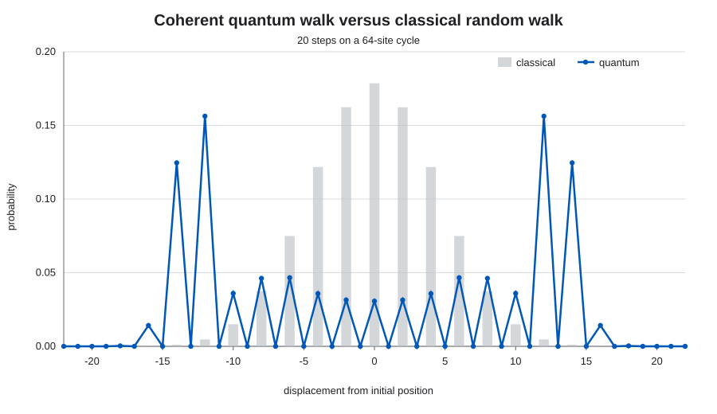
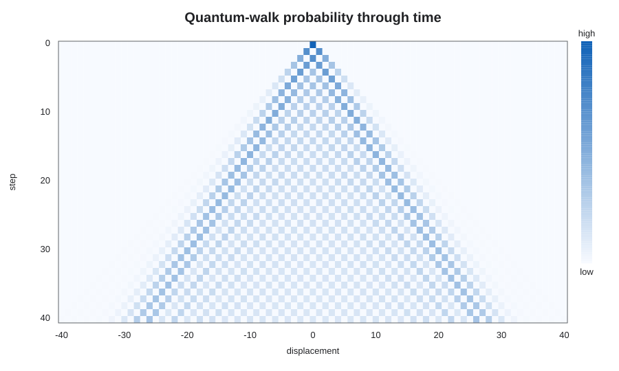
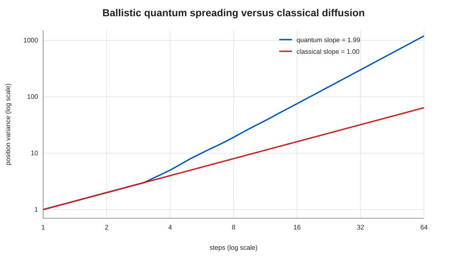

# SQCS Quantum Random Walk

A reproducible implementation of coherent discrete-time quantum walks, rebuilt
from the original 2021 SQCS hackathon project.

## What changed in v2

The original prototype explored quantum-controlled addition, subtraction, and
two-dimensional motion. Version 2 keeps that work in the repository as project
history and replaces the executable model with a standard coined quantum walk:

$$
|\psi_{t+1}\rangle = S(C \otimes I)|\psi_t\rangle.
$$

The coin and position registers remain coherent between steps. There are no
intermediate measurements or resets. This is essential: the nonclassical
distribution is produced by interference between the walker's paths.

The first rebuilt milestone includes:

- a transparent NumPy reference simulator;
- a Qiskit circuit using a Hadamard coin and coherent modular shifts;
- exact classical random-walk distributions for comparison;
- cross-validation between Qiskit and NumPy;
- a CLI that writes CSV data and publication-ready plots;
- automated tests on every push and pull request.

## Results

The coherent walk develops sharp interference peaks that are absent from the
binomial classical distribution:



The full time history makes the coherent, ballistic wavefront visible:



On a cycle large enough to avoid wraparound, the position variance separates
the two processes quantitatively. The quantum walk approaches
$\operatorname{Var}(X)\propto t^2$, while the classical walk follows
$\operatorname{Var}(X)\propto t$:



## Model

The Hilbert space is $\mathcal{H}_C \otimes \mathcal{H}_P$. The two coin states
select the direction of the conditional shift:

$$
S|0,x\rangle=|0,x-1\bmod N\rangle,\qquad
S|1,x\rangle=|1,x+1\bmod N\rangle.
$$

The default initial coin state is
$(|0\rangle+i|1\rangle)/\sqrt{2}$, which removes the directional bias of a
Hadamard walk. Qiskit circuits currently require $N=2^n$; the NumPy reference
supports any cycle size.

## Install

```bash
python -m venv .venv
source .venv/bin/activate
python -m pip install -e '.[dev]'
```

## Run

Generate an exact quantum/classical comparison:

```bash
qrw --size 32 --steps 10 \
  --output results/qrw_1d.csv \
  --plot results/qrw_1d.png
```

Use the Python API:

```python
from qrw import quantum_distribution
from qrw.qiskit_circuit import build_walk_circuit

probability = quantum_distribution(size=32, steps=10)
circuit = build_walk_circuit(size=32, steps=10)
```

## Validate

```bash
pytest
PYTHONPATH=src python scripts/generate_figures.py
```

The tests check probability conservation, reject non-unitary coins, ensure the
Qiskit circuit contains no resets or measurements, and compare its exact
statevector distribution against the independent NumPy model.

## Repository history

The root-level 2021 scripts are the original hackathon prototypes. They use an
obsolete Qiskit API and include resets inside the walk, so they are retained as
historical artifacts rather than presented as the validated implementation.

## Roadmap

- finite line with a unitary reflecting boundary;
- two-dimensional coined walk;
- biased and parameterized coin operators;
- shot-based and noisy simulation;
- variance and interference diagnostics;
- circuit-depth and transpilation studies for real hardware.
